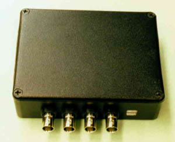

---
title: "Digital Correlator guide"
collection: post
permalink: /year-archive/2019/04/Digital Correlator guide
date: 2019-04-03
tag:
  - Digital correlator
  - flex03lq-01
---
# Digital Correlator

## System requirements:
A USB 2.0 enabled PC.  Pentium 4 at 2GHz or more.  Windows with native USB 2.0 support.   
For Windows 2000/ME/98, a PCI USB2.0 adapter card with the software support may be necessary.

## Flex03LQ-1 hardware specifications:
- Input signal: standard TTL pulses.
- Four BNC connectors
- One USB connector.
- Easy to use FlexWindows software and software for Windows98/2000/ME/XP/Vista libraries included.
- Correlator specifications:

### 1. Dual Channel Multiple Tau modes (3 modes)
In all multiple tau correlation modes, the intensity history of both channels may be saved to the hard drive. 
- Minimum sample time 100 ns
- Sample time increment: 16 ns
- Maximum sample time: 65535 * 12.5ns = 1.048ms
- Real time histogram are calculated.

---
#### Mode A. Single auto/cross correlator.
-  Minimum sample time: 1.56ns
-  Auto or cross correlation. ( AxA or AxB)
-  Total number of channels: 1088 each
-  Sample times:   
	- First 64 channels : 1.56ns
	- Next 32 channels: 2 x 1.56ns 
	- Sample times double every 32 channels  
	- Total of 34 segment
-  Delay times: from 1.56ns to36.7 minutes.
- Shift register width:  in the order of the segments 1,2,3, 4, 5, 6, 7, 8, 9, 10, 11, 12, 13, 14,15,32, …32.
- Maximum intensity before overflow: 640 MHz within 1.56ns, 44  MHZ continuous.

---
#### Mode B: Dual auto/cross correlator.

- Minimum sample time: 1.56ns
- Auto or cross correlation. ( AxA, BxB, or  AxB BxA)
- Total number of channels: 608 each
- Sample times: 
	-  First 32 channels : 1.56ns
	-  Next 16 channels: 2x1.56ns
	-  Sample times double every 16 channels. 
	-  Total of 38 segment
- Delay times: from 1.56nsns to 586 minutes.
- Shift register width:  in the order of the segments 1,2,3, 4, 5, 6, 7, 8, 9, 10, 11, 12, 13, 14,15,32, …32.
- Maximum intensity before overflow: 640 MHz within 1.56ns, 44  MHZ continuous.

---
#### Mode C: Quad correlator.
- Minimum sample time: 1.56ns
- Auto and cross correlations. ( AxA, BxB,  AxB, BxA)
- Total number of channels: 288
- Sample times:   
	- First 16 channels : 1.56ns
	- Next 8 channels: 2*1.56ns
	- Sample times double every 8 channels
	- Total of 35 segment
- Delay times: from 1.56ns to 28.6 minutes.
- Shift register width:  in the order of the segments 1,2,3, 4, 5, 6, 7, 8, 9, 10, 11, 12, 13, 14,15,32, …32.
- Maximum intensity before overflow: 640  MHz within 1.56ns, 44   MHZ continuous.

### 2. Quad Channel Multiple Tau mode
- Minimum sample time: 1.56ns
- 4 correlations (mxn where m and n could be any one of the input channel). 
- Total number of channels: 288
- Sample times:   
	- First 16 channels : 1.56ns
	- next 8 channels: 2*1.56ns
	- Sample times double every 8 channels
	- Total of 35 segment
- Delay times: from 1.56ns to 28.6 minutes.
- Shift register width:  in the order of the segments 1,2,3, 4, 5, 6, 7, 8, 9, 10, 11, 12, 13, 14,15,32, …32.
- Maximum intensity before overflow: 640  MHz within 1.56ns, 44   MHZ continuous.

The correlator has four tunable tau modes, 8 bit 1M, 8 bit 2M, 16 bit 512K, and 32 bit 2M mode.  
In contrast to multiple tau modes, there is only one sample time in single modes for all channels.

#### Mode A: Single Tau Mode
##### (1) 8 bit 1M mode Specifications:
- Sample times minimum: 0.4 microsecond.
- Maximum sample time 819.1875 microseconds.

- The number of channels (N) may be chosen from a minimum of 32 to a maximum number of channels 1024 in increment of 2. 
- The delay channels may be spaced arbitrarily from delay times 0 to 1M-1 in unit of the sample time.
- Efficiency (E) is calculated as the following formula. $E = (S*80-1)*\frac{2}{N}$ or
 $ E = 100\%$ for $N \le(S*80-1)*2. $
- Where S is the sample time in microseconds
- Uses connector A for auto (AxA) and B for cross (AxB)

##### (2) 8 bit 2M mode Specifications:
- Sample times minimum: 0.4 microsecond.
- Maximum sample time 819.1875 microseconds.
- The number of channels (N) may be chosen from a minimum of 32 to a maximum number of channels 1024 in increment of 2. 
- The delay channels may be spaced arbitrarily from delay times 0 to 1M-1 in unit of the sample time.
- Efficiency (E) is calculated as the following formula. E = (S*80-1)*2/N or 100% for N < =(S*80-1)*2. Where S is the sample time in microseconds
- Uses connector A for auto (AxA) and B for cross (AxB)
##### (3) 16 bit 512K mode Specifications: 
- Sample times minimum: 12.8 microsecond.
- Maximum sample time: 1638 microseconds.
- The number of channels is always 1022. 
- The delay channels may be spaced arbitrarily from delay times 0 to 512K-1 in unit of the sample time.
- Always real time operation.
- Uses connector A for auto (AxA) and B for cross (AxB)

 

##### (4) 32 bit 2M mode Specifications:
- Sample times minimum: 1 millisecond.
- Maximum sample time: 107 seconds.
- The number of channels is always 1024. 
- The delay channels may be spaced arbitrarily from delay times 0 to 2M-1 in unit of the sample time.
- Always real time operation.
- Uses connector A for auto (AxA) and B for cross (AxB)

##### (5) Dual photon history recorder mode specifications:
- System clock: 60 MHz in two channel mode.
- 16.7 ns pulse pair resolution.
- Complete time series recorded on a PC hard drive for average count rate up to 10Mhz or above.  The maximum count rate is -somewhat host PC dependent.
- More about multiple tau theory.

> Multiple tau theory was invented by Klaus Schätzel.  The following papers discuss the theory and the advantage of the multiple tau scheme.
Klaus Schätzel. Single Photon Correlation Techniques. Dynamic Light Scattering: The method and some applications, Edit by Wyn Brown, Clarendon Press, Oxford, P 76, 1993.
Klaus Schätzel et.  Noise on Multiple-Tau Photon Correlation Data.   SPIE Vol. 1430, P109, Photon Correlation Spectroscopy: Multicomponent Systems, 1991.
Klaus Schätzel. New Concept in Correlator Design. Inst. Phys. Conf. Ser. No. 77, P175, 1985.
Klaus Schätzel et.  Photon Correlation Measurements at Large Lag Times.  Journal of Modern Optics, Vol. 35, No. 4, P711, 1988.